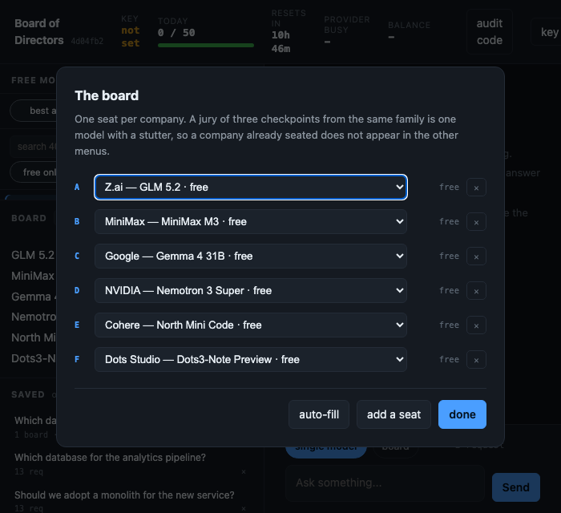
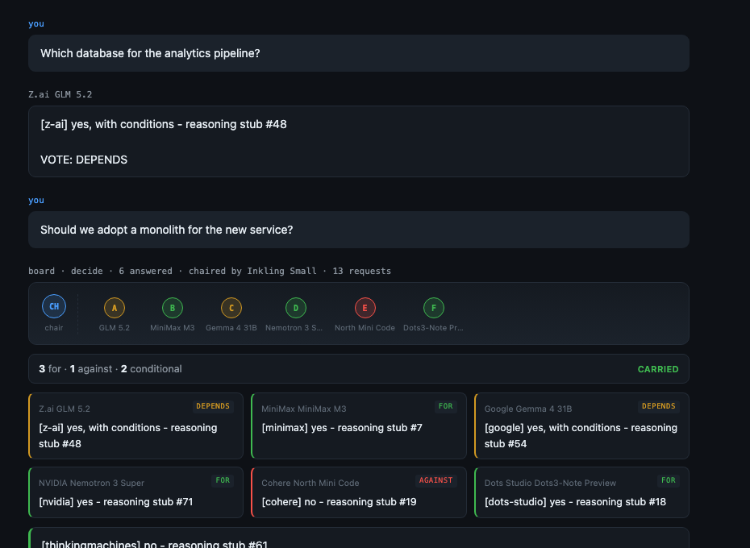
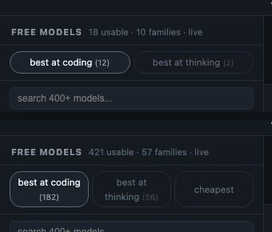
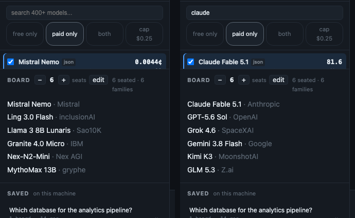
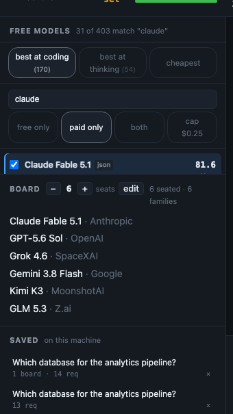
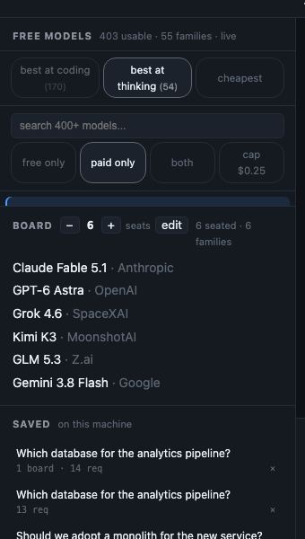

# Board of Directors

[](https://github.com/jedisolana/board-of-directors/actions/workflows/tests.yml)
[](https://pypi.org/project/jedi-board-of-directors/)
[](https://github.com/jedisolana/board-of-directors/releases)
[](pyproject.toml)
[](pyproject.toml)
[](LICENSE)

**A board made of other people's models.**

Ask a question once and several models from *different companies* answer it independently,
rank each other blind, and a chair that didn't vote writes the decision — with the vote
counted and the dissent kept.

It runs on OpenRouter's free tier, so it costs nothing to try. Point it at paid models when a
question is worth money.


```bash
pipx install jedi-board-of-directors && board
```

The prefix is not decoration — `boardofdirectors` on PyPI belongs to somebody else, and PyPI
reads hyphens as if they weren't there. Same project, same `board` command.

Or straight from `main`, for changes that are not in a release yet:

```bash
pipx install git+https://github.com/jedisolana/board-of-directors && board
```

Or from a clone: `python3 -m boardofdirectors.cli` runs it with nothing installed, and
`pipx install .` gives you the `board` command.

That's the whole thing. No dependencies, no build step, no key required to look around — it
opens a console in your browser, served from your own machine.

## You need one thing: a free OpenRouter key

The models are OpenRouter's, so the board talks to them with **your** OpenRouter key. There is
no account with us — there is no us. Three steps, about two minutes, no card:

1. Make a free account at **[openrouter.ai](https://openrouter.ai)** (sign in with Google,
   GitHub, or an email).
2. Create a key at **[openrouter.ai/keys](https://openrouter.ai/keys)**. It starts with
   `sk-or-v1-`.
3. Paste it into the console when it asks — or run `board setup` in the terminal.

The key is saved to a file only you can read, in `~/.board-of-directors` on your machine, and
it is sent to OpenRouter and nowhere else. The free tier gives **50 requests a day**; putting
**$10 of credit on the account once** raises that to **1,000 a day, permanently** — you never
have to spend the ten dollars. Details under *[What the free tier gives you](#what-the-free-tier-gives-you)*.

> **Why `pipx` and not `pip`.** Homebrew, Debian and Ubuntu all ship a Python that refuses a
> bare `pip install` now ("externally managed"). `pipx` is the standard way to install a
> *program* rather than a library: it gets its own environment and a command on your PATH.
> A virtualenv with `pip install -e .` inside it works just as well if you prefer.

> **On the screenshots.** The two under *Here it is working* are real sessions against live
> models — the text is what those models actually said. The interface shots use the built-in
> offline stub — `board --offline` opens the whole console on it, no key, no request, nothing
> leaves your machine — so anyone can reproduce them. Nothing is a mock-up.

Using it from your own code? → **[docs/library.md](docs/library.md)**
Eight ready-made shapes are in there too — `recipes.dream`, `brainstorm`, `build`, `red_team`,
`check_idea`, `review`, `audit`, and `supply_chain`, where a different model works each step.

Already have a bot? It speaks OpenAI — point any client at `http://127.0.0.1:8420/v1` and ask
for the model **`board`**. A whole board's decision comes back in the shape your client
already parses, with the vote attached.

---

## Here it is working

Four free models from four companies, asked whether a two-person startup should write
automated tests before product-market fit. Each answered without seeing the others; then they
ranked each other blind; then a chair that never voted wrote this:


It counted the vote — **3–1 against** — named the dissent, and gave four reasons it did not
carry, including that *"the blind rankings unanimously placed B last."* Then it said what
would reverse the decision.

That is the thing one model cannot give you: **a position that has already survived being
argued with.**

### And when it goes wrong, it says so

A different session. Three members answered; two were rate limited by their providers:


Two members missing, named, **not counted as agreement**. The board does not quietly become a
three-model board and present a tidier result.

---

## Why a board instead of one model

Because one model agrees with itself. Ask it twice and you get its opinion twice, which looks
like confirmation and isn't.

[Verga et al., *Replacing Judges with Juries*](https://arxiv.org/abs/2404.18796) found that a
panel of several **smaller** models beats one big judge — and the reason is that the panel is
drawn from **disjoint model families**. That word carries the result. Seat three checkpoints
of the same family and you haven't built a jury, you've built one model with a stutter.

**Six seats by default.** The `− 6 +` picker fills them for you; **edit** opens the board.



A company already seated does not appear in the other menus, so an illegal board cannot be
built by hand. Each seat shows what it costs per call.

The picker The ceiling is the number
of *companies* with a usable model, not an arbitrary number — because it's enforced: **at most
one seat per family.** Ask for more seats than there are families
and you get fewer seats and a reason — never a padded board.

---

## You watch it happen


The room fills as the board answers. Every member is a seat; the chair sits apart and does not
vote. A seat pulses while that member is thinking, then takes the colour of the vote it
declared — green **for**, red **against**, amber **conditional**, hatched if the model never
answered at all.

A session takes about a minute. Reporting nothing until it is over turns deliberation into a
spinner and hides the only part worth watching.

## You can see the vote



Members declare a position and the board counts it: one dot per seat, the totals, and whether
the motion **carried**.

Read from what members declared, **never inferred from their prose**. A member who did not
state a position is recorded *undeclared*. Guessing a vote from someone's wording is putting
words in their mouth and then counting them.

A tie reads as **split**. Nothing here rounds a disagreement into a decision.

---

## The rules it enforces

**One seat per family.** Independence is structural, not a prompt you write.

**Members answer alone.** In round one no member sees another's answer. There's a test.

**The ranking round is blind.** Members see each other as "Member A", "Member B" — a name on
an answer moves a ranking. The mapping is kept for the audit trail and revealed afterwards.

**The chair does not vote.** A member who also counts the votes is not a chair. If it refuses,
another model takes the chair — one model's refusal does not discard four good answers.

**A member who failed is not a member who agreed.**

> When a model is rate limited it doesn't answer. If the board reads "no answer" as "no
> objection", the vote still completes, still prints a tidy consensus, and is now a decision
> made by whoever happened not to be throttled. **The board looks most confident exactly when
> it knows least.**

Too few answers returns **NO QUORUM** rather than a confident result from the survivors.

**Nothing leaves without passing the seam.** `redact` refuses — it does not scrub — on API
keys, private keys, JWTs, bearer headers, private and Tailscale addresses, `.ssh` paths and
`.env` files.

---

## One conversation, two modes

Most turns go to a single model for **one request**. When a question is worth more, the same
thread convenes the board and the chair's verdict lands back in it. You pay eleven requests
only on the turns you choose to, and the cost of the next turn is shown before you send it.

| | |
|---|---|
| **decide** | A jury. Positions, reasons, dissent. For *"should we?"* |
| **make** | A competition. Every member attempts the task; the ranking judges whether they actually **did** it; the chair delivers the winning attempt improved with what the others got right. For *"build me a…"* |

That distinction exists because the first version only had **decide**, and asking it to build
something produced four models solemnly taking a position on whether building it was wise.

## Audit a folder of code


Point it at a project. It reads the files **on your machine**, packs them into one message, and
asks one model or the whole board. A 1,600-line project is about 16,500 tokens; GLM 5.2 reads
256,000, so most codebases fit many times over.

A **loader, not a harness**: you choose the folder, the model never decides what to open next.
That plays to what these models are good at — reading a lot and answering once — and away from
what they are worst at. It also costs one request instead of ten.

**Every file is scanned for secrets before anything is sent.** A folder with findings is
refused, with the file named and the secret masked, and an explicit per-send override for the
fixtures every real repo has.

## And it can write the change

Auditing tells you what is wrong. Type a task into the same panel — *"fix the subtraction bug
in add()"* — and the board writes the fix instead, in **make** mode: every member attempts it,
the ranking judges whether they actually did it, and the chair delivers the best attempt.

You get a **diff per file, with an apply button.** Nothing is written until you press it.

**The model never touches your disk.** It returns whole files; the server diffs them against
what is there and shows you. Whole files rather than unified diffs on purpose — a model that
miscounts a hunk header produces a patch that either fails to apply or applies to the *wrong
lines*, and the second is far worse.

Four guards, each for a failure that would otherwise be silent:

| | |
|---|---|
| a path that escapes the folder | refused — and refused, not *normalised*: `.lstrip("./")` strips a set of characters rather than a prefix, and turned `../../.ssh/config` into `ssh/config` |
| a file the board never saw | refused — it cannot be proposing an informed change to it |
| a file that moved since the scan | refused — the proposal was written against text that is no longer there |
| the previous contents | kept in `~/.board-of-directors/backups` before every write |

## It keeps what the board said

Sessions are saved to your machine and reopen **as they happened** — every member's answer,
every failure and why, the chair. Not just the verdict: a session that stored only the
conclusion would reopen looking unanimous.

**Export** writes the whole proceeding as markdown for a pull request or a decision log, with
the dissent and the missing members in it.

---

## What the free tier gives you

From [OpenRouter's rate-limit docs](https://openrouter.ai/docs/api-reference/limits) —
upstream's numbers, so check them there if a limit surprises you:

| | requests/day |
|---|---|
| under $10 of credits ever purchased | **50** |
| $10+ of credits ever purchased | **1000** |

Plus **20 requests per minute**.

The $10 is a **one-time, all-time threshold** — not a balance you spend down. It moves which
row you're on, permanently. **20× your daily free capacity for ten dollars.**

**It doesn't ask you which row you're on.** OpenRouter reports `is_free_tier` when it verifies
your key, and the account knows what its owner often doesn't.

**One thing to be honest about:** the daily limit is account-wide. Seating more models buys
independence and routes around a slow provider — **it does not raise the ceiling.**

### The counter can be exact, if you let it

An ordinary key cannot see its own usage, so by default the meter counts its own calls and
labels the figure **estimated**.

The real number does exist. `/api/v1/analytics/query` serves a `request_count` metric and
answers an ordinary key with `403 — "Only management keys can access analytics"`. Add an
optional **management key** and the meter reads OpenRouter's own count.

**Read the warning first.** A management key cannot make completions, but it *can* create and
delete your API keys. So it is opt-in, stored separately, and **only ever sent to the
analytics endpoint, only to read**. A test parses that module and fails if any URL in it is
anything but `/analytics/query`.

### Two kinds of 429

`429` from OpenRouter means you are out of allowance. `429` from an upstream **provider** means
that company is busy — it costs you nothing. They are the same status code and they mean
opposite things; conflating them is how a meter reaches 58/50 while every other model on the
board answers perfectly. Provider refusals get their own counter and do not move the meter.

---

## Paid models

Everything above is free. When a question is worth money, seat models that cost some.

Flip **include paid** and all 431 models become seatable, each with its price on the row.
Frontier reasoning models, the big Claude and GPT tiers, anything on OpenRouter.

**This is the only part of the program that can spend your money, so it is built the other way
round from the rest.** Everywhere else, being wrong safely means admitting ignorance. Here it
means not spending.

**Off by default.** A default board costs nothing, and the toggle asks you to confirm in words.

**The permission is not consent.** A session needs both the stored setting *and* the send
asking for it. A flag from last week must not be what decides today's question costs money.

**The chair follows the members.** The chair is chosen by the program, not by you, so it can
never be the thing that turns a free session into a paid one.

**The estimate comes before the send.** It sits next to the request count as you type:
`about $0.03`. A cost you learn afterwards is a bill, not a decision.

**It rounds up, always.** Being pleasantly surprised is the only acceptable direction for this
number to be wrong in.

**Unpriced is refused, not costed at zero.** Unknown is not free, and unknown cannot be
consented to.

**The cap is a wall.** Over it, the send is refused with the figure and the cap, not a warning
you can click through.

### Three modes



**free only** · **paid only** · **both**

Three rather than two, because *paid* and *free and paid* are different wants. Somebody paying
for quality may not want free models on the board at all — **a weak free seat is not a
bargain, it is a vote.**

- **free only** — 18 seatable models, and the locked state
- **paid only** — 403 seatable, no free model can take a seat or the chair
- **both** — 421 seatable

**free only is a lock, not a preference.** It sets a `$0.00` cap the server enforces before it
seats anything, so nothing that costs money can run — not by switch, not by a saved board that
still holds paid members, not by anything the interface can do. It is where you start and
where the switch puts you back.

The other two ask you to confirm in words, then a **cap $0.25** chip appears. Click it to
change the number. Switching modes also drops members the new mode does not allow, so a board
seated while spending was on cannot cost you money later.

### If you bought the $10 only for the rate limit

Plenty of people will. It moves free models from 50 to 1000 requests a day and is never meant
to be spent — the balance is a **key, not a wallet**.

For that, "paid is switched off" is one stray click away from being wrong. So there's a
**lock**: set the cap to `$0.00` and nothing that costs money can run at all — not by toggle,
not by a saved board that had paid models in it, not by anything the interface can do. The
server refuses before it seats. The balance sits there doing its only job.

The header shows it: `$10.00 🔒`.

Your **balance** is in the header, read from OpenRouter with your ordinary key. "About $0.03"
means something different at $10 than at $0.

> Two bugs found building this, both worth knowing if you price models yourself.
> `openrouter/auto` publishes its price as **−1**, a sentinel for "depends what I pick" —
> multiplied to per-million that reads as *minus a million dollars* and sorts to the top of
> cheapest-first. And every `openrouter/*` id is a **router**, not a model: two routers can
> quietly pick the same underlying model, and one-seat-per-family would guarantee nothing.
> Neither can hold a seat.

---

## Free models come and go

Every hard-coded list rots. The catalogue is read live from OpenRouter's public endpoint (no
key needed) and falls back to the bundled snapshot only when the network fails — and it always
says which it used and how old it is, because a model that stopped being free yesterday will
bill you.

**Two traps it hides.** Context and completion limits are **asymmetric** — a model with room
for your prompt may still refuse your output length. And free variants are not the paid model
at zero price, they're the paid model with **parameters removed**. OpenRouter *silently drops*
a parameter a model doesn't support, so you ask for JSON, get an essay, and get a `200`.

## Picking a model

Sort by **best at coding** or **best at thinking**, using Artificial Analysis scores that
OpenRouter ships. They are different rankings — a coding specialist can sit mid-table on code
and dead last on reasoning. Hover for all three indices including agentic, which says how a
model behaves inside a harness.

Every paid model carries its price on its own line — `$5/M in · $25/M out` — and a **cheapest**
sort appears once paid models are in the list.



The right-hand figure is what **one call actually costs**, in cents, because `$/M` is not a
number anyone can feel. It runs from `0.0044¢` to `60¢` across the catalogue — a four-order
spread that decides whether a five-seat board costs nothing or costs five dollars.

With paid on there are over 400 seatable models, so there is a search box. Type a vendor, a
family or part of an id and the header says how many matched.



Each tab says how many models it can actually rank — **best at thinking (2)** — so you know
before you click. Scored models come first, then a line saying how many have no score for that
dimension, then those, dimmed.



They are **unmeasured, not bad**. Filling a missing score with zero would rank a model bottom
for a fact nobody established.

**And the scores move.** `intelligence_index` was populated for most free models one morning
and `null` for most of them by that evening — OpenRouter's upstream data changed, not the
code. A tab that is empty says so rather than looking broken.

---

## Removing it

    pipx uninstall jedi-board-of-directors
    rm -rf ~/.board-of-directors

The second line is the one that matters: it deletes your saved key, the request ledger and
your saved sessions. Uninstalling the program alone leaves them where they are, because a
program should never delete your data on its way out — you do that, on purpose.

## Your key cannot end up in the repo

It lives in `~/.board-of-directors/`, which is **not inside the project** — there is no path by
which committing the repo commits your key. Structure, not vigilance.

The second line is a pre-commit hook that reads what you have *staged* and refuses the commit
if anything in it looks like a credential:

```bash
git config core.hooksPath .githooks    # once, after cloning
```

Git does not run hooks from a fetched repo, by design — so it is off until you turn it on.

There is a `post-commit` hook alongside it that stamps every commit `+0900`, keeping the exact
instant and changing only the offset. Delete it if you would rather your commits say where you
are; it is a preference, not part of the program.

## Tests

```bash
python3 -m unittest discover -s tests
ruff check .
```

**253 tests, no network, no dependencies.** CI runs them on Linux, macOS and Windows. Most are failure paths, because a board that works
when every model answers is the easy half. They cover a throttled member, the seam catching a
key, a pool with no independent members left, two consoles writing the counter at once, a paid
model trying to reach a free board — and, after being caught by them the hard way, whether the
page references elements that exist and whether a closed dialog is actually hidden.

## Licence

MIT.

Built by [@jedisolana](https://x.com/jedisolana).
