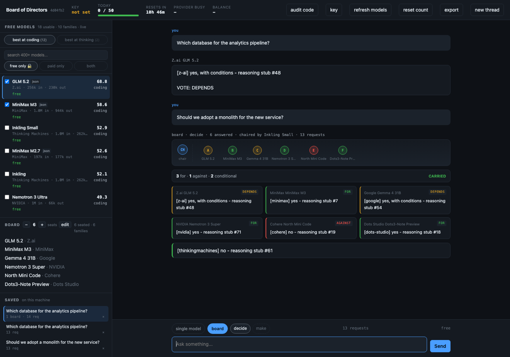
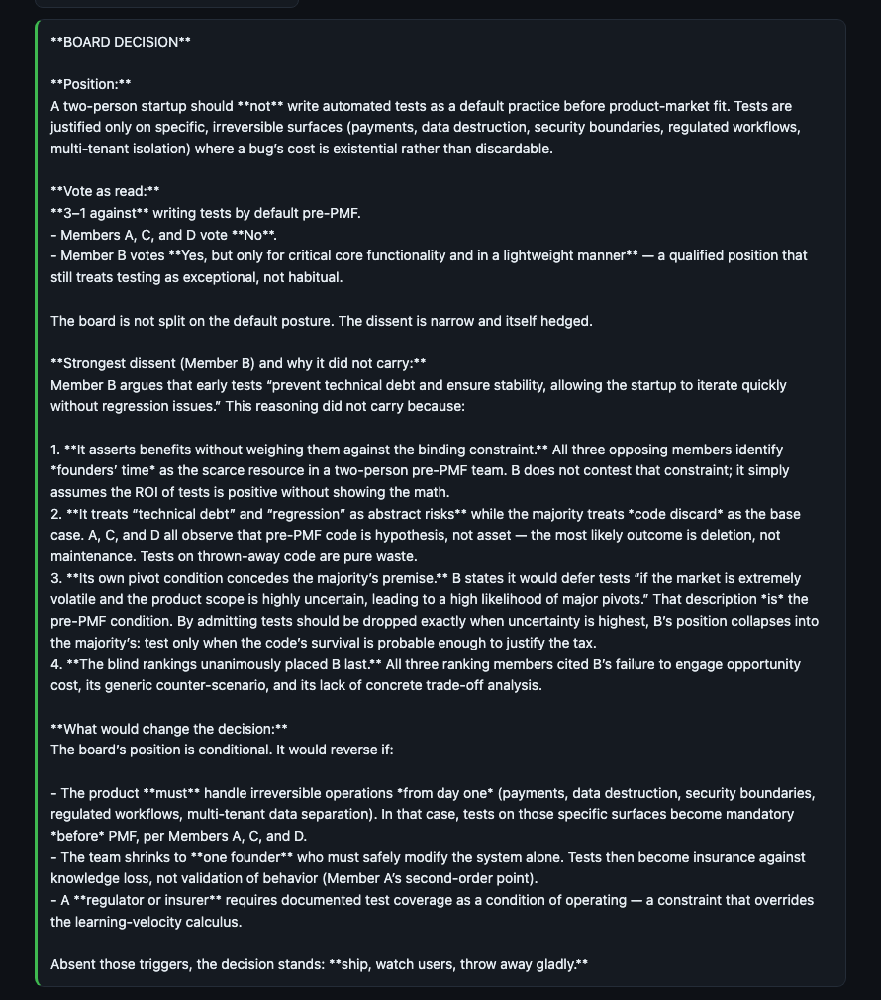
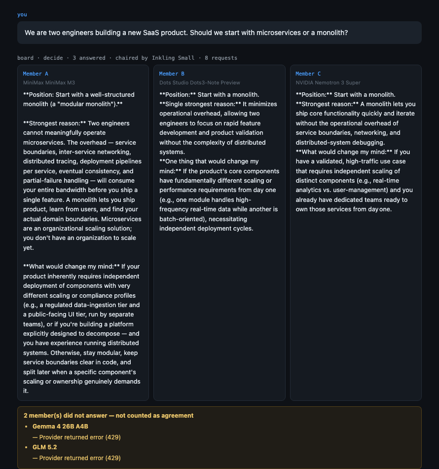
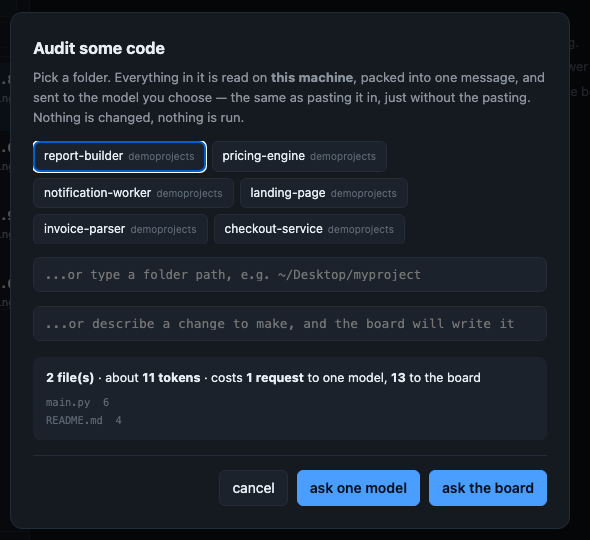
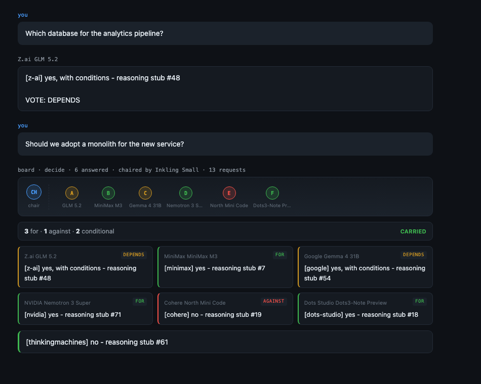

# Board of Directors

**A board made of other people's free models.**

Ask a question once and several models from *different companies* answer it independently,
rank each other blind, and a chair that didn't vote writes the decision. It runs on
OpenRouter's free tier, so it costs nothing to try.



```bash
python3 -m boardofdirectors.cli
```

From a clone of this repo, that's the whole thing. No dependencies, no build step, no key
required to look around — it opens a console in your browser, served from your own machine.

> The two screenshots below the interface are from **real sessions against live free models**,
> not mock-ups. The interface shot above is driven by the offline stub so it costs nothing to
> reproduce.

---

## Here it is working

A real session. Four free models from four companies, asked whether a two-person startup
should write automated tests before product-market fit. Each answered without seeing the
others; then they ranked each other blind; then a chair that never voted wrote this:



It counted the vote — **3–1 against** — named the dissent, and gave four reasons it did not
carry, including that *"the blind rankings unanimously placed B last."* Then it said what
would reverse the decision.

That is the thing one model cannot give you: a position that has already survived being
argued with.

### And when it goes wrong, it says so

An earlier real session, on a different question. Three members answered; two were rate
limited by their providers:



Two members missing, named, **not counted as agreement**. The board does not quietly become a
three-model board and present a tidier result.

---

## Why a board instead of one model

Because one model agrees with itself. Ask it twice and you get its opinion twice, which looks
like confirmation and isn't.

[Verga et al., *Replacing Judges with Juries*](https://arxiv.org/abs/2404.18796) found that a
panel of several **smaller** models beats one big judge — and the reason is that the panel is
drawn from **disjoint model families**. That word carries the result. Seat three checkpoints
of the same family and you haven't built a jury, you've built one model with a stutter.

So board enforces it: **at most one seat per family.** Ask for more seats than there are
families and you get fewer seats and a reason — never a padded board.

## One conversation, two modes

Most turns go to a single model for **one request**. When a question is worth more, the same
thread convenes the board: every member reads the conversation so far, answers independently,
and the chair's verdict lands back in the thread. Switch back and the next single model
continues from that verdict.

You pay eleven requests only on the turns you choose to, and the cost of the next turn is
shown next to the mode toggle before you send it.

The board itself has two kinds, and they use opposite prompts:

| | |
|---|---|
| **decide** | A jury. Positions, reasons, dissent. For *"should we?"* |
| **make** | A competition. Every member attempts the task; the blind ranking judges them on whether they actually **did** it; the chair delivers the winning attempt improved with what the others got right. For *"build me a…"* |

That distinction exists because the first version only had **decide**, and asking it to build
something produced four models solemnly taking a position on whether building it was wise.

## Audit a folder of code



Point it at a project. It reads the files **on your machine**, packs them into one message,
and asks one model or the whole board. Your whole codebase usually fits many times over —
GLM 5.2 reads 256,000 tokens, and a 1,600-line project is about 16,500.

This is a **loader, not a harness**. You choose the folder; the model never decides what to
open next. That plays to what free models are good at — reading a lot and answering once —
and away from what they're worst at, which is driving themselves through a task. It also
costs one request instead of ten.

**Every file is scanned for secrets before anything is sent.** A source tree is exactly where
a stray key or a private address lives. A folder with findings is refused, with the file named
and the secret masked. There's an explicit *"I've looked at these, send anyway"* tick, because
example keys in test fixtures are normal — but you tick it every time, and it's never
remembered.

---

## You watch it happen



The room fills as the board answers. Every member is a seat; the chair sits apart and does not
vote. A seat pulses while that member is thinking, then takes the colour of the vote it
declared — green **for**, red **against**, amber **conditional**, hatched if the model never
answered at all.

A board session takes about a minute. Reporting nothing until it is over turns deliberation
into a spinner and hides the only part worth watching: members disagreeing, one at a time.
Answers stream in as they land.

## You can see the vote

Every member declares a position — **for**, **against**, or **conditional** — on its own line,
and the board counts them. One dot per seat, the count in words, and whether the motion
**carried**.

The tally is **read from what members declared, never inferred from their prose.** A member
who did not state a position is recorded as *undeclared* and shown as such. Guessing a vote
from someone's wording would put words in their mouth and then count them — the same failure
as counting a silent member as agreement, one step further along.

The chair is handed the count rather than asked to work it out from five essays, and is told
not to attribute a vote to a member who never declared one.

A tie is reported as **split**. Nothing here rounds a disagreement into a decision.

---

## It keeps what the board said

A board session costs nine to eleven of a fifty-a-day allowance and produces the one thing a
single model cannot. Throwing that away when you close the tab is the difference between a
demo and a tool.

Sessions are saved to your machine, listed newest-first in the sidebar, and reopen exactly as
they happened — **every member's answer, every member that failed and why, and the chair**.
Not just the verdict: a session that stored only the conclusion would reopen looking
unanimous, which is precisely the dishonesty the board exists to prevent. A week later you
must still be able to see the vote was 3–1 and that two members were rate limited.

**Export** writes the whole proceeding as markdown you can paste into a pull request, an issue
or a decision log — with the dissent and the missing members in it. A board's output is only
worth keeping if the disagreement comes with it.

---

## The rules it enforces

**One seat per family.** Independence is structural, not a prompt you write.

**Members answer alone.** In round one no member sees another's answer. There's a test for it.

**The ranking round is blind.** Members see the other answers as "Member A", "Member B" —
because a name on an answer moves a ranking. The mapping is kept for the audit trail and
revealed afterwards. A test asserts no model id ever leaks into a ranking prompt.

**The chair does not vote.** A member who also counts the votes is not a chair.

**A member who failed is not a member who agreed.**

> When a model is rate limited it doesn't answer. If the board reads "no answer" as "no
> objection", the vote still completes, still prints a tidy consensus, and is now a decision
> made by whoever happened not to be throttled. **The board looks most confident exactly when
> it knows least.**

So every call returns an `Answer` or a `Failure`, never an empty `Answer`. Failures are counted
and named, and if too few got through, the session returns **NO QUORUM** rather than a
confident answer from the survivors.

**Nothing leaves without passing the seam.** `boardofdirectors.redact` refuses — it does not scrub —
on API keys, private keys, JWTs, bearer headers, private and Tailscale addresses, `.ssh` paths,
`.env` files and home-directory paths. A scrubber that quietly rewrites your prompt is worse
than a wall: you never learn you nearly sent a key.

---

## What the free tier actually gives you

From [OpenRouter's rate-limit docs](https://openrouter.ai/docs/api-reference/limits), read
2026-09-04:

| | requests/day |
|---|---|
| under $10 of credits ever purchased | **50** |
| $10+ of credits ever purchased | **1000** |

Plus **20 requests per minute**.

The $10 is a **one-time, all-time threshold** — not a balance you spend down. It moves which
row you're on, permanently. That's **20× your daily free capacity for ten dollars**.

**board doesn't ask you which row you're on.** OpenRouter reports `is_free_tier` when it
verifies your key, and the account knows what its owner often doesn't. The question only
appears if OpenRouter declines to answer.

**One thing to be honest about:** the daily limit is account-wide. Seating more models buys
independence and routes around a slow provider — **it does not raise the ceiling.** If you've
read that spreading a board across many free models multiplies your free capacity, that's
wrong, and this won't tell you it.

### The counter can be exact, if you let it

An ordinary inference key cannot see its own usage — so by default the meter counts its own
calls and labels the figure **estimated**.

But the real number does exist. `/api/v1/analytics/query` serves a `request_count` metric, and
answers an ordinary key with `403 — "Only management keys can access analytics"`. Add an
optional **management key** (from `openrouter.ai/settings/management-keys`) and the meter
reads OpenRouter's own count instead of guessing.

**Read the warning before you do.** A management key cannot make completions, but it *can*
create and delete your API keys. So it is opt-in, stored separately from the inference key,
and **only ever sent to the analytics endpoint, only to read**. There is a test that parses
this module and fails if any URL in it is anything but `/analytics/query`.

Without one, everything works exactly as before.

### And when it has to guess, it says so

You can't ask how many free requests you have left. OpenRouter's own docs: *"Successful
inference responses do not include `X-RateLimit-*` headers."* And `/api/v1/key` reports
**credits**, which stay at zero on the free tier while you burn through the day.

They tell you the truth exactly once: on a 429. So the ledger counts its own calls, labels the
figure **estimated**, and stops estimating the moment a 429 hands over the real numbers — then
keeps subtracting from that. It's explicit that calls made with the same key elsewhere are
invisible, so the true remaining is that figure or lower, never more.

---

## Free models come and go

Every hard-coded free-model list rots. The catalogue is read live from OpenRouter's public
models endpoint (no key needed) and falls back to the bundled snapshot only when the network
fails — and it always says which one it used and how old it is, because a model that stopped
being free yesterday will bill you.

It also filters out rows that are priced at zero but aren't board material: a router that
hides which member answered, a guardrail classifier, a music model. Seating those looks like a
working board that never deliberates.

**Two more traps the catalogue hides.** Context and completion limits are **asymmetric** — a
model with room for your prompt may still refuse your output length. And free variants are not
the paid model at zero price, they're the paid model with **parameters removed** — including
the ones that return a vote as data instead of prose. OpenRouter *silently drops* a parameter
the model doesn't support, so you ask for JSON, get an essay, and get a `200`.

## Picking a model

The list sorts by **best at coding** or **best at thinking**, using Artificial Analysis scores
that OpenRouter ships in its catalogue. They're different rankings — a coding specialist can
sit mid-table on code and dead last on reasoning. Hover any row for all three indices,
including agentic, which is the one that says how a model behaves inside a harness.

Models with no published scores show a dash and sort last. They are **unmeasured, not bad** —
filling a missing score with zero would rank a model bottom for a fact nobody established.

---

## Use it from Python

```python
from boardofdirectors import board

session = board.ask("Should we rewrite the parser this quarter?")
print(session.report())

session.voted        # members who actually answered
session.failures     # members who did not — never counted as agreement
session.no_quorum    # set if the board could not legitimately decide
session.labels       # "Member A" -> model id, the audit trail
```

| command | |
|---|---|
| `board` | open the console |
| `board ask "<question>"` | one session in the terminal |
| `board board` | who's seated, and the chair |
| `board budget` | how many sessions your account gets |
| `board check "<text>"` | test the outbound seam, sending nothing |
| `board refresh` | re-read the live catalogue |

## Tests

```bash
python3 -m unittest discover -s tests
ruff check .
```

102 tests, no network, no dependencies. Most of them are failure paths, because a board that
works when every model answers is the easy half. They cover what happens when a member is
throttled, when the seam sees a key, when the pool has no independent members left, when two
consoles write the counter at once — and, after being caught by them the hard way, whether the
page references elements that exist and whether a closed dialog is actually hidden.

## Licence

MIT.
